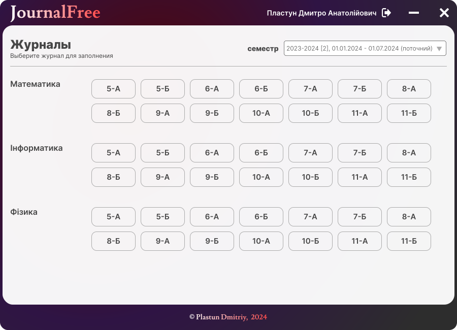
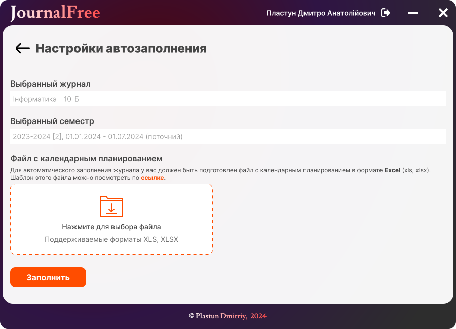

## Автозаполнитель журнала nz.ua
### Установка
- На компьютере должен быть установлен **python 3.11** или новее.
- Клонировать репозиторий через ***git clone*** или просто скачать архив и распаковать в папку.
- Установить виртуальное окружение ```python -m venv venv```
- Активировать виртуальное окружение:
  * Windows ```.\venv\Scripts\activate```
  * Linux ```source venv/bin/activate```
- Запустить программу командой ```python journal_free/main.py```

### Возможные проблемы
#### В целом все ошибки описаны информативно, однако:
- На этапе авторизации может быть антибот ошибка, однако авторизоваться можно, просто пытаться в течении минуты-двух, при дальнейшем использовании проблем не наблюдалось.
- Так же важным пунктом есть строгое оформление ексель файла, что бы не было ничего лишнего в первых столбцах.




